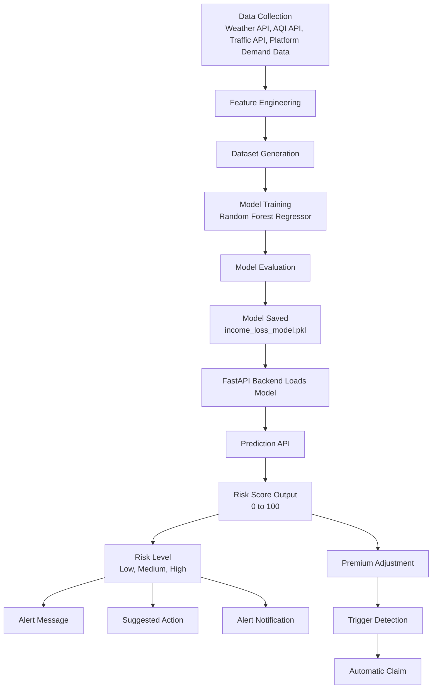

# LivPay AI AI Model Workflow

## Diagram Prompt

```text
Create an AI workflow diagram for an Income Loss Prediction system.

Inputs:
- City Risk
- Zone Risk
- Weekly Income
- Rainfall
- AQI
- Temperature
- Working Hours
- Orders Per Day
- Traffic Index
- Platform Demand Index

Steps:
1. Data Collection (Weather API, AQI API, Traffic API)
2. Feature Engineering
3. Dataset Generation
4. Model Training (Random Forest Regressor)
5. Model Evaluation
6. Model Saved (.pkl)
7. Backend loads model
8. Prediction API
9. Risk Score Output (0-100)
10. Risk Level (Low/Medium/High)
11. Alert Message
12. Premium Adjustment
13. Trigger Detection
14. Automatic Claim

Output:
Income Loss Risk Score
Risk Level
Suggested Action
Alert Notification
```

## Mermaid Workflow



## Model Inputs

- `city_risk`
- `zone_risk`
- `weekly_income`
- `rainfall_mm`
- `aqi`
- `temperature_c`
- `working_hours`
- `orders_per_day`
- `traffic_index`
- `platform_demand_index`

## Model Outputs

- `income_loss_risk_score`
- `risk_level`
- `reason`
- `suggested_action`
- `alert_message`
