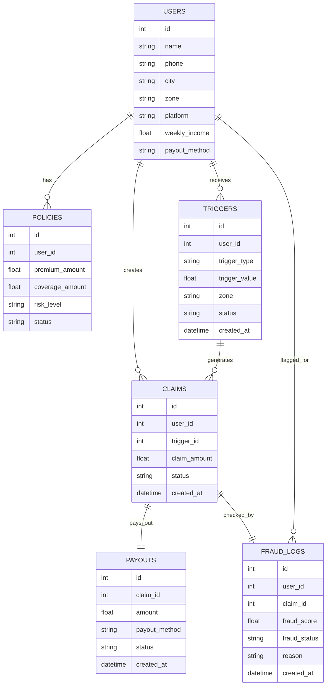

# LivPay AI Database Schema

## Diagram Prompt

```text
Create a database schema diagram for a parametric insurance platform.

Tables:

Users:
id, name, phone, city, zone, platform, weekly_income, payout_method

Policies:
id, user_id, premium_amount, coverage_amount, risk_level, status

Triggers:
id, user_id, trigger_type, trigger_value, zone, status, created_at

Claims:
id, user_id, trigger_id, claim_amount, status, created_at

Payouts:
id, claim_id, amount, payout_method, status, created_at

FraudLogs:
id, user_id, claim_id, fraud_score, fraud_status, reason, created_at

Relationships:
User -> Policies (1 to many)
User -> Triggers (1 to many)
User -> Claims (1 to many)
Claims -> Payouts (1 to 1)
Claims -> FraudLogs (1 to 1)
Triggers -> Claims (1 to many)

Create ER diagram style database schema.
```

## Mermaid ER Diagram


