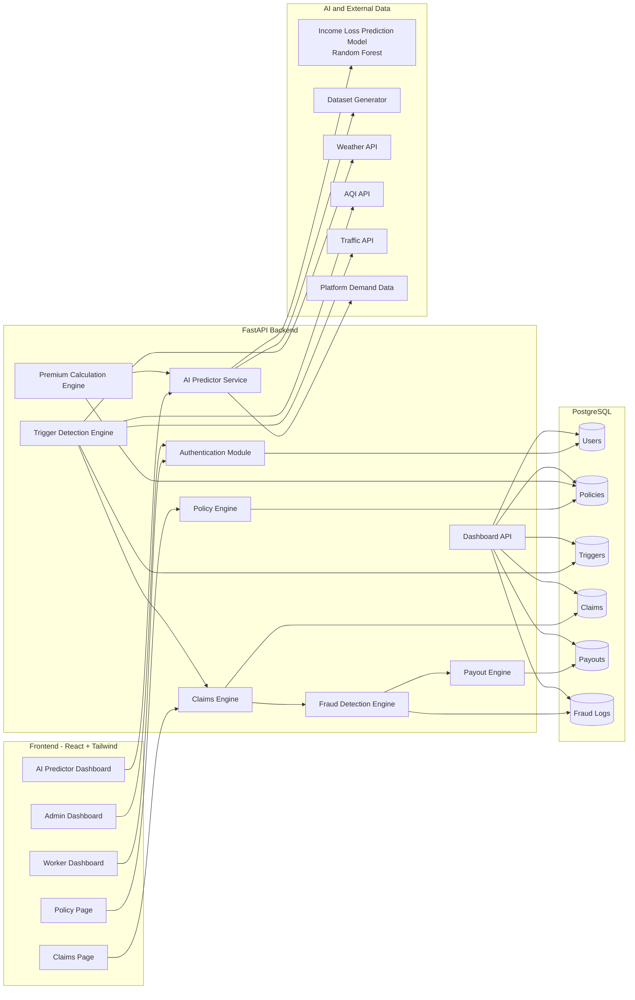

# LivPay AI System Architecture

This document captures the system architecture for the AI-based parametric insurance platform.

## Diagram Prompt

```text
Create a system architecture diagram for an AI-based parametric insurance platform called LivPay AI.

The system should include:

Frontend:
- React + Tailwind Worker Dashboard
- Admin Dashboard
- Claims Page
- Policy Page
- AI Predictor Dashboard

Backend:
- FastAPI Server
- Authentication Module
- Policy Engine
- Premium Calculation Engine
- Trigger Detection Engine
- Claims Engine
- Fraud Detection Engine
- Payout Engine
- Dashboard API
- AI Predictor Service

Database:
- PostgreSQL Database with tables:
  Users
  Policies
  Triggers
  Claims
  Payouts
  Fraud Logs

AI/ML:
- Income Loss Prediction Model (Random Forest)
- Dataset Generator
- Weather API
- AQI API
- Traffic API
- Platform Demand Data

Flow:
Frontend -> FastAPI Backend -> PostgreSQL Database
Backend -> AI Predictor Service -> ML Model
Backend -> Weather/AQI/Traffic APIs
Triggers -> Claims -> Fraud Check -> Payout

Make the architecture clean and modern like a startup system architecture diagram.
```

## Mermaid Architecture


